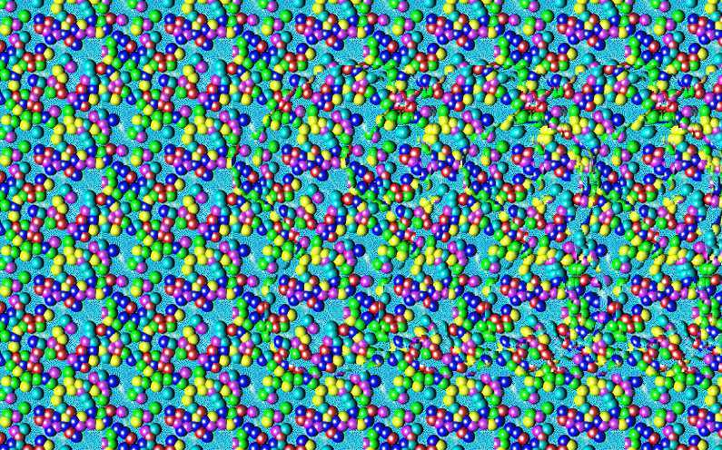

# MACSIMUS

**MACSIMUS is a free classical molecular modeling and dynamics package.**

## Quickstart

* Needed:
  * Linux, Windows/WSLg, Windows+CygWin...
  * `gcc` or other ANSI C compiler
  * packages `libc6-dev libx11-dev`
  * for some utilities also: `g++ ncurses-base libncurses5-dev`
* Installation:  
  * Download/unzip the package
  * Run script `./install.sh` from the package home
* Help:
  * [MANUAL](man/macsimus.pdf)
  * Most utilities and programs print a help if run without a parameter, a few need option `-h`
  * In GUI, there is always `[help]` button
  * Right mouse click a function button gives context help
* Customization:
  * To compile a tailored version of the simulation program cook, run `./configure.sh` from subdirectory `cook`
  * List of compile-time switches: `MACSIMUS/cook/generic/simopt.h`
  * To tailor `blend`, find `blend/metamake.mmk`
  * Force field parameters are in `MACSIMUS/blend/data/`
* Troubleshooting:
  * lot of errors, directory bin/ is almost empty: check script `bin/mvexe.sh`
  * cannot find libraries to link: check file `compile.mmk`
  * `blend, pdb` do not work: check enviroment variable BLENDPATH

## Features

* `cook*`: a family of molecular dynamics programs in different boundary conditions supporting:
  * SHAKE and Lagrangian constraint dynamics
  * Verlet/leap-frog and modified Gear integrators
  * thread-based parallelization
  * Ewald summation (classical r- and k-space formulas) or cut-off electrostatics
  * point and Gaussian charges
  * potentials: Lennard-Jones, exp-6 (Busing), metal (RGL tight binding) and more
  * boundary conditions: free (vacuum), periodic, walls, slab geometry
  * cache-optimized triangular pair sum, linked cell list method, full periodic sums
  * several models of polarizability: Drude, shell-core, saturated
  * SCF integrated by ASPC, optionally iterations or PSPC
  * surface tension via pressure tensor or virtual area method, FFT-based cutoff corrrections
  * virial pressure and virtual volume change
  * full pressure tensor calculation (with polarizability, constraints, Ewald)
  * radial distrubution functions, dihedral angle distributions, density profiles
  * structure factors
  * cross sections, cluster analysis, radii of gyration
  * shear viscosity calculations (NEMD, Green-Kubo)
  * diffusion coefficients, bulk conductivity (NEMD, Green-Kubo)
  * several thermostats and barostats, adiabatic expansion
  * normal mode vibration also for systems with constraints (as rigid water models)
* `blend`: force field builder and energy minimizer with many features:
  * essential dynamics
  * normal mode vibrations
  * simple molecule editor
  * rmsd, inertia matrix, and internal angle analysis
  * second virial coefficient
  * several models of dipolar polarizability (except Gaussian charges)
  * anaglyph
* `show`: molecule and trajectory viewer:
  * matching of two configurations
  * output in two ray tracer formats (NFF and PovRay)
  * showing backbones, shells of water molecules, cross sections, etc.
  * embedded outputs: animated GIFs, raytracing, stereograms
* analysis of simulation results:
  * `showcp`: convergence profiles
  * `staprt`: statistical errors and time correlation functions
  * `ramachan`: Ramachandran plot
  * `plbinfo +u`: tools to work with trajectories
  * `spectrum`: FFT for any factorization of the number of points, not only 2^n
* selected utilities:
  * `pdb`: simple converter from the PDB format with some editing
  * `plot`: plot graph (with formulas, fitting...)
  * `tabproc`: command-prompt oriented spreadsheet (I love command prompt)
  * `ev evu`: prompt oriented calculator, without and with units
  * `start`: start application according to file extension (I love command prompt)
  * `plbinfo +u`: shows tools for working with MACSIMUS trajectory files *.plb
  * `ray`: Mark VandeWettering "reasonably intelligent raytracer"
  * `sortcite`: sort LaTeX citations as they are first referenced
  * `ice naclcryst lattice`: decent crystal support
  * `lemon`: fgrep extension
* Bugs:
  * `blend` does not support Gaussian charges (e.g., for BK3/AH force field)
  * The manual may contains obsolete parts
  * The set of available force field parameter files is poor

## History

Project MACSIMUS (MACromolecule SIMUlation Software) started in 1991 in the group of professor Perram at Odense University, Denmark, under name PROSIS (PROtein SImulation Software), and continued at MIP, Theoretical Chemistry at Northwestern University, and the Institute of Chemical Process Fundamentals. Now at the Department of Physical Chemistry of the University of Chemistry and Technology, Prague, it is developed towards fluid simulations, ionic systems, surface phenomena, and polarizability.

A stereogram generated by MACSIMUS is seen below (parallel eyes type)

